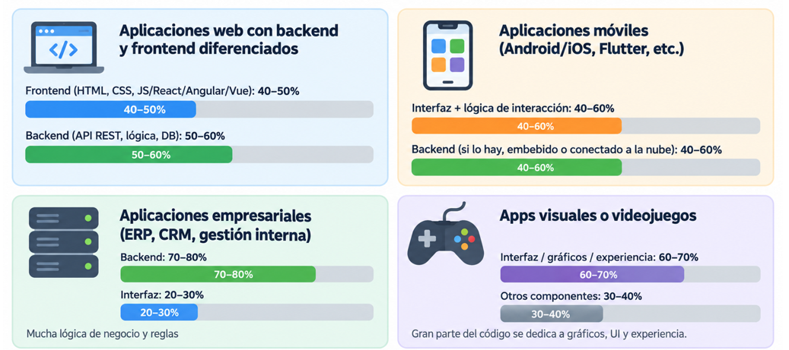
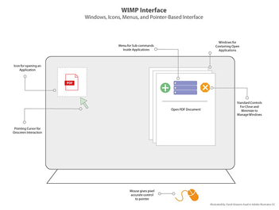
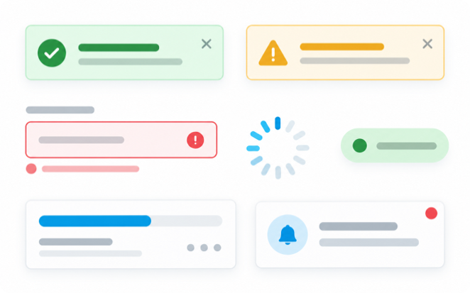

# UT1.2 Sistemas y elementos de interacción. Interfaces naturales

## Introducción

```note
💡 La *Interacción Persona-Ordenador* (**IPO**), también conocida como *Human-Computer Interaction* (**HCI**), es la disciplina dedicada a estudiar cómo se produce la interacción entre las personas y los sistemas informáticos para tratar de mejorar esta relación por medio del diseño gráfico.
```

Su objetivo principal es incrementar la productividad de los equipos y minimizar los errores al tiempo que se dota a los usuarios de una experiencia segura, confortable y satisfactoria.

> “La Interacción persona-ordenador es la disciplina relacionada con el diseño, evaluación y implementación de sistemas informáticos interactivos para el uso de seres humanos, y con el estudio de los fenómenos más importantes con los que está relacionado. ”


Generalmente, los sistemas informáticos son interactivos e involucran al usuario en la resolución de tareas. Para conseguir esta interacción o diálogo entre persona- ordenador se utiliza la **interfaz**. Esta interfaz de usuario determina, en gran medida, la percepción que el usuario tendrá de una aplicación y es un factor de gran importancia para conseguir una aplicación exitosa.


Licklider y Clark, en 1962, elaboran una lista con los diez problemas más comunes que deberán ser resueltos para **facilitar la interacción entre las personas y los ordenadores**:

1.  Compartir el tiempo de uso de los ordenadores entre muchos usuarios.
2.  Un sistema de entrada-salida para la comunicación mediante datos simbólicos y gráficos.
3.  Un sistema interactivo de proceso de las operaciones en tiempo real.
4.  Sistemas para el almacenamiento masivo de información que permitan su recuperación.
5.  Sistemas que faciliten la cooperación entre personas en el diseño y programación de grandes sistemas.
6.  Reconocimiento por parte de los ordenadores de la voz, de la escritura manual impresa y de la introducción de datos a partir de escritura manual directa.
7.  Comprensión del lenguaje natural, sintáctica y semánticamente.
8.  Reconocimiento de la voz de varios usuarios por el ordenador.
9.  Descubrimiento, desarrollo y simplificación de una teoría de algoritmos.
10. Programación heurística o a través de principios generales.

Hansen en su libro *User Engineering Principles for Interactive Systems* hace la primera enumeración de **principios para el diseño de sistemas interactivos**:

1. Conocer al usuario.
2. Minimizar la memorización, sustituyendo la entrada de datos por la selección de ítems, usando nombres en lugar de números, asegurándose un comportamiento predecible y proveyendo acceso rápido a información práctica del sistema.
3. Optimizar las operaciones mediante la rápida ejecución de operaciones comunes, la consistencia de la interfaz y organizando y reorganizando la estructura de la información basándose en la observación del uso del sistema.
4. Facilitar buenos mensajes de error, crear diseños que eviten los errores más comunes, haciendo posible deshacer acciones realizadas y garantizar la integridad del sistema en caso de un fallo de software o hardware.

### Código de una interfaz

Los estudios realizados por Myers y Rosson en una encuesta hecha a diferentes desarrolladores, demuestran que alrededor del **52%** del código de una aplicación está dedicado a la interfaz de usuario.


Otros estudios demuestran que el 80% de los costes de mantenimiento de una aplicación son debidos a problemas del usuario con el sistema y no con errores de código o bugs. Entre ellos, alrededor del 64% son problemas de usabilidad.

A pesar de su importancia la interacción persona-ordenador es una disciplina a la que no se le da el suficiente valor en ciertos campos y, muchas veces, no se utiliza en el momento de hacer la documentación de un proyecto. Igualmente la experiencia de usuario es un campo al que cada vez se le da más importancia empresarial y académica.

Algunas referencias aproximadas que se suelen observar:

- **Aplicaciones web con backend y frontend diferenciados***:
    - Frontend (HTML, CSS, JS/React/Angular/Vue): 40–50% del código.
    - Backend (API REST, lógica, DB): 50–60%.
- **Aplicaciones móviles (Android/iOS, Flutter, etc.)**:
    - Interfaz + lógica de interacción: 40–60%.
    - Backend (si lo hay embebido o conectado a la nube): 40–60%.
- **Aplicaciones empresariales (ERP, CRM, gestión interna)**:
    - Backend suele ser mucho mayor porque hay mucha lógica de negocio y reglas: 70–80% backend, 20–30% interfaz.
- **Apps visuales o videojuegos**:
    - Gran parte del código se dedica a gráficos, UI y experiencia: puede ser 60–70% interfaz.




## El factor humano

```note
La **cognición** es el proceso por el que los humanos adquirimos conocimientos e interactuamos con el entorno.
```

Sobre los usuarios es importante entender cuáles son sus capacidades y los procesos de **cognición** involucrados durante el desempeño de tareas a través del computador: la memoria, la visión, el oído o el tacto, son factores que determinan cómo manipulan y hace uso efectivo de la tecnología computacional, radicando allí la importancia del factor humano para optimizar su interacción.


### Canales de Entrada y Salida

En una interacción con el ordenador el usuario recibe información que es generada por el ordenador, y responde proporcionando una entrada al ordenador.

- La **entrada** en el ser humano se produce a través de los sentidos:
    - Vista
    - Oído
    - Tacto
    - Olfato
    - Gusto

    

- La **salida** se producirá mediante movimiento de los dedos, ojos, extremidades o cabeza, así como mediante el habla.

Los canales de entrada humanos tienen **restricciones** como es por todos conocidos. Por ejemplo para el sistema visual:


### La memoria

La **memoria** humana se corresponde a una función del cerebro que permite codificar, almacenar y recuperar información.

Está dividida en 3 tipos a su vez:

-   **Memoria sensorial:** información captada por los sentidos (instantánea)
-   **Memoria de corto plazo o de trabajo** (*MCP*): se conoce también como memoria primaria o memoria activa, refiere a la capacidad de conservar en la mente de forma activa una pequeña cantidad de información, de manera tal que se localice disponible inmediatamente durante un corto periodo de tiempo. La duración de la MCP está estimada en varios segundos y unos 7-9 objetos.
-   **Memoria de medio plazo** (*MMP*): es aquí donde se envía la información desordenada, con el propósito de que sea organizada, eliminar duplicados, evaluar frente a otra información que choquen entre sí y la información útil será enviada a nuestra memoria de largo plazo.
-   **Memoria de largo plazo** (*MLP*): se conoce también como memoria inactiva o memoria secundaria refiere al tipo de memoria que provee un almacenamiento de mayor capacidad y con mayores tiempos de permanencia para la información.


## Sistemas de interacción

La **interacción** son las diferentes formas en que las personas interactúan con un computador o dispositivo. Existen diferentes tipos de interacción, tal y como ya hemos señalado anteriormente y que describiremos en detalle:

-   Interacción mediante comandos
-   Selección y navegación
-   Manipulación directa de la interfaz
-   Mediante interacción conversacional
-   Interacción natural y multimodal
-   Interacción espacial y contextual


### Interacción mediante comandos

Denominada interfaz CLI, fue el primer estilo de interacción informático. Indica instrucciones al ordenador directamente mediante teclas y comandos de palabras completa o abreviaturas con parámetros.


#### Ventajas

-   Flexibilidad: Las opciones de la orden pueden modificar su comporta orden puede ser aplicada a muchos objetos a la vez.
-   Permite la iniciativa del usuario.
-   Es atractivo para usuarios expertos y potencialmente rápido para tareas complejas.

#### Desventajas

-   Requiere un memorización y entrenamiento importantes: No hay indicación visual de la orden que se necesita y es más útil para usuarios expertos.
-   Gestión de errores pobre.

### Selección y navegación

Un caso concreto de **WIMP**: Un menú se puede plantear como un grupo de alternativas visualizadas en la pantalla, que se pueden seleccionar de forma individual o grupal lo que da como respuesta la ejecución de una orden subyacente que provoca un cambio en el estado de la interfaz.


#### Ventajas

-   Entrenamiento reducido, menos tecleo.
-   Permiten el uso de herramientas de gestión de diálogos.
-   Toma de decisión estructurada.

#### Desventajas

-   Pueden resultar lentos para usuarios experimentados: Solución: atajos de teclado.
-   Ocupan mucho espacio en la interfaz: Solución: menús desplegables y pop-up.
-   Requieren una visualización rápida.

### Manipulación directa de la interfaz

Las pantallas de alta resolución, las pantallas táctiles y los dispositivos apuntadores, como el ratón, han permitido la creación de los entornos de manipulación directa, estas interfaces suponen un cambio de una sintaxis de comandos compleja a una manipulación de objetos y acciones con gran facilidad, siendo el entorno más común de manipulación directa la interfaz **WIMP** (*Windows, Icons, Menús, Pointers*) y **post-WIMP** (*tap, swipe, pinch, gestos*)



#### Ventajas

-   Sintaxis más sencilla, reduce los errores.
-   Aprendizaje más rápido y mejor retención.
-   Incita a la exploración por parte del usuario.
-   El uso de gestos y atajos facilita su utilización.

#### Problemas

-   Se necesitan más recursos (no todas las tareas pueden ser descritas por objetos concretos y no todas las acciones se pueden hacer directamente).

### Mediante interacción conversacional

El usuario expresa una necesidad utilizando lenguaje natural, escrito o hablado: 
- Un **asistente** responde preguntas, guía tareas o propone acciones.
- Un **agente** interpreta una acción y devuelve resultados o ejecuta tareas.

#### Ventajas

- Lenguaje natural e inmediato

#### Desventajas

- Problemas de comprensión
- Privacidad
- Respuestas imprecisas


### Interacción natural y multimodal

La **interacción natural** y multimodal permite al usuario comunicarse con un sistema utilizando formas de interacción habituales para las personas, como **la voz, los gestos, el tacto o la mirada**. Se denomina multimodal cuando varias de estas formas de interacción pueden utilizarse de manera combinada dentro de una misma interfaz. 


#### Ventajas

- Interacción más intuitiva y natural.
- Puede mejorar la accesibilidad.
- Facilita experiencias más inmersivas.

#### Problemas

- Los gestos o comandos pueden ser ambiguos.
- Puede requerir sensores, cámaras o micrófonos adicionales.
- Cansancio del usuario.


### Interacción espacial y contextual

La interacción espacial y contextual permite que el sistema tenga en cuenta el entorno físico y la situación del usuario para adaptar la interfaz o responder a sus acciones.
Este tipo de interacción aparece en tecnologías como la realidad aumentada, la realidad mixta o la realidad virtual. El sistema puede utilizar información como la posición del usuario, el lugar, la orientación del dispositivo, o los objetos presentes en el entorno.

#### Ventajas

- Facilita experiencias inmersivas y personalizadas.
- Es útil en formación, industria o domótica. 

#### Problemas

-   Altos requerimientos tecnológicos
-   Coste de desarrollo
-   Interrupciones visuales


## Elementos de interacción de una GUI

Los **elementos de interacción** permiten organizar el contenido, introducir datos, ejecutar acciones y comunicar el estado del sistema. La elección correcta depende de la tarea, el dispositivo y las necesidades del usuario:

- **Organización**
    - ventanas, paneles, cards

- **Navegación**
    - menús, pestañas, búsqueda

- **Entrada**
    - campos y selección

- **Acciones**
    - botones, enlaces, menús

- **Feedback**
    - estado, progreso y errores
    
- **Diálogos**
    - modales y overlays
    
- **Comunicación visual**
    - iconos, texto, color y espacio
    
- **Estados y reutilización**
    - propiedades, eventos y variantes
    


### Contenedores y organización

Un **contenedor** agrupa dentro de una interfaz contenido relacionado.
- En escritorio predominan las **ventanas** y los **paneles**. 
- En web y móvil aparecen cards, acordeones, paneles laterales y hojas inferiores.

- **Clásicos**
    - Ventanas
    - Paneles
    - Pestañas


- **Actuales (Web y móvil)**
    - Cards · acordeones
    - Sidebars · drawers
    - Bottom sheets
    


La agrupación debe hacer visible qué elementos pertenecen a una misma tarea. Un exceso de contenedores añade ruido y dificulta reconocer la jerarquía.


### Elementos de navegación

La **navegación** ofrece opciones visibles para que el usuario reconozca el camino. Puede ser global, local o contextual y debe mantener nombres, posiciones y comportamiento coherentes.


- **Estructura**
    - Barra superior
    - Menú lateral
    - Navegación inferior


- **Orientación**
    - Breadcrumbs
    - Pestañas
    - Paginación
    


Conviene que delimitar la profundidad de menús, indicar la ubicación actual y ofrecer búsqueda cuando el volumen de contenidos haga lenta la exploración.


### Controles de entrada (formularios)

Un **formulario** combina controles de entrada. Elegir el control adecuado reduce errores: escribir ofrece libertad, mientras que seleccionar limita las respuestas a valores válidos.

- **Estructura**
    - Campo de texto
    - Área de texto
    - Autocompletado


- **Selección**
    - Checkbox · radio
    - Select · switch · slider
    - Fecha y archivo


Cada campo tendrá una etiqueta clara, formato esperado, validación próxima al dato y una indicación visible de cuando resulte obligatorio.


### Controles de acción (botones)

Los **botones** representan acciones. Los enlaces llevan a otro contenido. Los iconos y menús contextuales ahorran espacio, pero necesitan una representación comprensible.

- **Acción principal**
    - Un botón destacado por pantalla o sección dirige la tarea prioritaria.


- **Acción secundaria**
    - Botón secundario
    - Botón con icono
    - Enlace · menú contextual
    


El texto del botón describe la acción. Las operaciones destructivas tendrán una diferenciación visual y, cuando el riesgo lo justifica, confirmación o posibilidad de deshacer.


### Información y feedback

Los elementos de **información y feedback** comunican qué está ocurriendo, si la operación terminó y qué debe corregirse. Puede aparecer junto al control afectado o como mensaje global de la interfaz.

- **Estado**
    - Badges · etiquetas
    - Indicador de carga
    - Barra de progreso


- **Mensajes**
    - Toast · snackbar
    - Alerta · banner
    - Error de validación



El mensaje, breve, indicará el resultado y ofrecerá una solución cuando exista. El color o la iconografía ayudará a la identificación del tipo de mensaje.


### Diálogos y elementos superpuestos

Los **diálogos** aparecen por encima del contenido: 
- Un **diálogo modal** bloquea temporalmente el resto de la interfaz. 
- Un elemento **no modal** permite continuar con otras tareas.

- **Modal**
    - Exige respuesta antes de continuar. Adecuado para decisiones importantes o datos imprescindibles.
    
- **No modal**
    - Popover · tooltip
    - Menú contextual
    - Panel o bottom sheet


Los diálogos modales interrumpen el flujo y conviene reservarlos para situaciones que requieren atención inmediata. Siempre necesitan una salida clara y control mediante teclado.
    
### Elementos de comunicación visual

**Iconos, tipografía**, color, imágenes o espaciado ayudan a interpretar la interfaz. No ejecutan siempre una acción, pero influyen en la legibilidad, la orientación y la comprensión.

- **Significado**
    - Iconos reconocibles
    - Imágenes relevantes
    - Color con una función


- **Jerarquía**
    - Tipografía legible
    - Contraste suficiente
    - Espaciado consistente


Un icono generalmente se apoya en texto de apoyo. La jerarquía visual debe hacer evidente qué contenido es principal y conservar legibilidad al ampliar texto o cambiar de pantalla.


## Interfaces naturales de usuario (NUI)

```note
Las **interfaces naturales de usuario**, denominadas NUI (Natural User Interface), son interfaces de usuario que se caracterizan por ser intuitivas y no necesitar aprendizaje previo. 
```

Las interfaces naturales de usuario buscan que los usuarios interactúen con el mundo digital de la misma forma que lo hacen con el mundo real. La característica principal de las NUI son la habilidad de interactuar con las máquinas utilizando únicamente el cuerpo humano, esto es, mediante el tacto, los gestos, la voz y otros métodos naturales de comunicación.

La palabra natural es utilizada, porque al contrario que la gran mayoría de interfaces, no usan dispositivos de control artificiales, como pueden ser un teclado o un ratón, sino controles que permiten desarrollar una experiencia natural e intuitiva utilizando sensores de audio, acelerómetros, infrarrojos, dispositivos multitouch, cámaras, etc. 

Objetivo principal: Reducir la curva de aprendizaje, hacer la interacción más intuitiva y cercana a cómo usamos el cuerpo o sentidos en la vida real. Que la interfaz “se adapte al usuario”, no al revés. 


### Principios del diseño en NUI

1. **Interacción sin Esfuerzo**: El usuario no debería necesitar manuales. La interacción debe ser intuitiva y fluida, aprovechando gestos y movimientos.

2. **Contexto y Consciencia Situacional**: El sistema debe entender el entorno y el contexto del usuario (lugar, hora, actividad, etc.) para ofrecer una respuesta adecuada.

3. **Realismo y Física**: Las interacciones deberían imitar el mundo físico. Los objetos virtuales deberían comportarse con inercia, peso y gravedad.

4. **Retroalimentación Inmediata (feedback)**: El sistema debe responder de forma instantánea a las acciones del usuario, ya sea con efectos visuales, sonoros o hápticos. 

5. **Personalización y Aprendizaje** La interfaz debe adaptarse al usuario con el tiempo, aprendiendo sus preferencias y patrones de comportamiento.


### Tipos de reconocimiento

- **Táctil, gestos y Movimiento**: Uso del cuerpo, manos y dedos para interactuar (ej. control por movimiento, realidad aumentada).

- **Voz y Lenguaje Natural**: Interacción a través de comandos de voz y conversación (ej. asistentes virtuales, domótica).

- **Visión y Seguimiento Ocular**: El sistema reconoce la mirada para saber dónde el usuario está prestando atención, permitiendo interacciones sin manos.


#### Reconocimiento táctil

- La interacción a través de pantallas táctiles es uno de los ejemplos más comunes de NUI. Los smartphones fueron los primeros dispositivos en implementar este tipo de  interfaces naturales de usuario en sus sistemas operativos.
- Los usuarios pueden navegar, ampliar o reducir imágenes, y escribir directamente sobre la pantalla con movimientos simples y naturales. Además, se han ido universalizando muchos gestos en pantallas como ampliar, reducir o mover elementos.

    


#### Reconocimiento de gestos

El reconocimiento gestual es una tecnología clave dentro del ámbito de las interfaces naturales de usuario (NUI) que permite a los dispositivos interpretar y responder a los movimientos del cuerpo humano, principalmente de las manos y los brazos. Este sistema se basa en el uso de sensores, cámaras y algoritmos avanzados de procesamiento de imagen para detectar, seguir y comprender gestos específicos realizados por el usuario.


#### Reconocimiento de la voz

El reconocimiento de la voz y el habla es otro interfaz natural de usuario de las más desarrollada, permitiendo la comunicación hablada entre persona y sistema.

Se maneja diferentes tipos de información, como:
- Acústica
- Fonética
- Léxica
- Sintáctica
- Semántica

Los asistentes virtuales como Siri, Google Assistant y Alexa de Amazon permiten a los usuarios realizar tareas mediante comandos de voz.

#### Reconocimiento ocular

El reconocimiento y seguimiento ocular (eye tracking) es la capacidad de un sistema para determinar dónde está mirando el usuario en tiempo real. En el contexto de NUI, la visión se convierte en un medio de control natural, eliminando la necesidad de otros dispositivos.


### Ventajas de las NUI

- **Intuitividad** mayor: menores barreras para empezar a usarlas. 

- **Experiencia de usuario** más inmersiva, atractiva, natural.

- Mejor **accesibilidad**: pueden permitir el uso por personas con discapacidad, o en situaciones en que no es práctico usar manos / teclado.

- Posibilidad de **interacción más rica**, con otros sentidos (vista, oído, tacto).

- **Potencial** para aplicaciones innovadoras (salud, entretenimiento, educación, domótica).


### Desventajas y retos de las NUI

- Precisión y **confiabilidad**: errores en reconocimiento de voz, gestos mal interpretados, falsas positivas o negativas.

- **Ambigüedad**: ¿qué gesto significa qué?, ¿cómo evitar que movimientos no intencionados se interpreten como inputs?

- **Latencia**: el retardo perceptible puede romper la sensación de naturalidad.

- **Hardware** especializado, coste, disponibilidad, consumo batería.

- **Fatiga física**: gestos constantes pueden cansar; mirar fijamente puede cansar; postura corporal incómoda.

