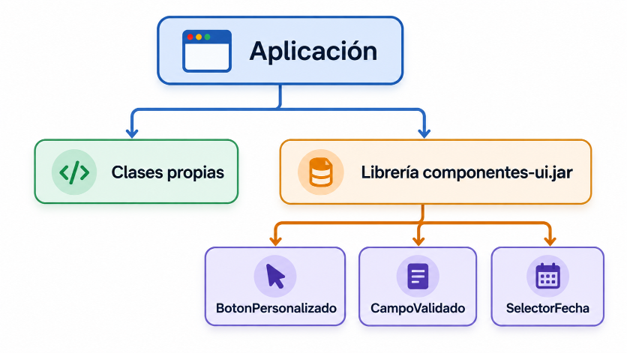

# UT2.1 Fundamentos, modelos y metodologías de desarrollo de interfaces

## Introducción

```note
Una interfaz gráfica es el puente entre el usuario y la aplicación. Los componentes tienen estado, responden a eventos y pueden empaquetarse para su reutilización.
```

El desarrollo de **interfaces gráficas** permite la creación del canal de comunicación entre el usuario y la aplicación, por esta razón requiere de especial atención en su diseño.

En la actualidad, las herramientas de desarrollo permiten la implementación del código relativo a una interfaz a través de vistas diseño que facilitan y hacen más intuitivo el proceso de creación. La programación orientada a objetos permite utilizar entidades o componentes que tienen su propia identidad y comportamiento.

En este unidad se verán en detalle los principales tipos de componentes de diferentes librerías así como sus características más importantes.

La distribución de este tipo de elementos depende de los llamados **layout**, los cuales permiten situar los elementos en la interfaz.


```tip
Un **componente software** está formado por **clases** creadas para ser reutilizadas con sus *propiedades* y que puede ser manipulada por una herramienta de desarrollo de aplicaciones visual.
```

Se define por su **estado** que se almacena en un conjunto de propiedades, las cuales pueden ser modificadas para adaptar el componente al programa en el que se inserte. También tiene un comportamiento que se define por los **eventos** ante los que responde y los **métodos** que ejecuta ante dichos eventos. 

Para que una aplicación pueda ser distribuida se **empaqueta** con todo lo necesario para su correcto funcionamiento, quedando independiente de otras bibliotecas o componentes.


## Programación Orientada a Objetos (POO)

En POO los objetos son entidades que tienen un determinado estado, comportamiento (método) e identidad:

-   El **estado** está compuesto de datos o informaciones, será uno o varios atributos a los que se habrán asignado unos valores concretos (datos).
-   El **comportamiento** está definido por los métodos o mensajes a los que sabe responder dicho objeto, es decir, qué operaciones se pueden realizar con él.
-   La **identidad** es una propiedad de un objeto que lo diferencia del resto, dicho con otras palabras, es su identificador (concepto análogo al de identificador de una variable o una constante).

La definición o instanciación de un objeto, con sus propiedades y comportamiento se lleva a cabo a través de las **clases**.

A su vez, los objetos disponen de mecanismos de interacción llamados **métodos**, que favorecen la comunicación entre ellos.

## Características de la POO

### Abstracción

```note
La **abstracción** es un procedimiento que permite la elección de una determinada entidad de la realidad, sus características y funciones que desempeñan, la cual es representada mediante clases que contienen atributos y métodos de dicha clase.
```


### Encapsulamiento

En POO, se acostumbra a proteger la información o el estado de los atributos para que no se pueda ver o modificar la información del objeto sin el mecanismo adecuado.

Para ello, se utilizan métodos para recuperar la información (**getters**) y a su vez, poder asignar (**setters**) un nuevo valor y verificar que no afecte la integridad del objeto.


### Herencia

```note
La **herencia** es un mecanismo que permite la definición de una clase a partir de la definición de otra ya existente.
```

Conceptos importantes:

-   **Superclase**: la clase cuyas características se heredan se conoce como superclase (o una clase base o una clase principal).
-   **Subclase**: la clase que hereda la otra clase se conoce como subclase (o una clase derivada, clase extendida o clase hija). La subclase puede agregar sus propios campos y métodos, además de los campos y métodos de la superclase.
-   **Reutilización**: la herencia respalda el concepto de reutilización, es decir, cuando queremos crear una clase nueva y ya hay una clase que incluye parte del código que queremos, podemos derivar nuestra nueva clase de la clase existente. Al hacer esto, estamos reutilizando los campos/atributos y métodos de la clase existente.

****

La clase `Laptop` sigue siendo una computadora, tiene todos sus atributos y métodos, pero agrega dos **atributos** y un método a la definición original, de lo que se conoce como **superclase**

### Polimorfismo

```note
El **polimorfismo** es la capacidad que tienen los objetos de una clase en ofrecer respuesta distinta e independiente en función de los parámetros usados durante su invocación.
```


## Conceptos de POO

### Clases

```note
Una **clase** representa un conjunto de objetos que comparten una misma estructura (atributos) y comportamiento (métodos).
```

A partir de una clase se podrán instanciar tantos objetos correspondientes a una misma clase como se quieran. Para ello se utilizan los **constructores**.

Para llevar a cabo la **instanciación** de una clase y así crear un nuevo objeto, se utiliza el nombre de la clase seguido de paréntesis. Un constructor es sintácticamente muy semejante a un método.

```note
El **constructor** de una clase puede recibir argumentos, de esta forma podrá crearse más de un constructor, en función del número de argumentos que se indiquen en su definición. Aunque el constructor no haya sido definido explícitamente, en Java siempre existe un constructor por defecto que posee el nombre de la clase y no recibe ningún argumento.
```

### Atributos

```note
Un **objeto** es una unidad dentro de un programa que tiene un estado, y un comportamiento.
```

La información contenida en el objeto será accesible solo a través de la ejecución de los **métodos** adecuados, creándose una interfaz para la comunicación con el mundo exterior.

Los **atributos** o propiedades definen las características del objeto. Por ejemplo, si se tiene una clase círculo, sus atributos podrían ser el radio y el color, estos constituyen la estructura del objeto, que posteriormente podrá ser modelada a través de los métodos oportunos.

La estructura de una clase en Java quedaría formada por los siguientes bloques, de manera general: **atributos, constructor y métodos.**


### Métodos

```note
Un **método** es una subrutina cuyo código es definido en una clase y puede pertenecer tanto a una clase, como es el caso de los métodos de clase o estáticos, como a un objeto, como es el caso de los métodos de instancia.
```

Los métodos definen el comportamiento de un objeto, es decir, toda aquella acción que se quiera realizar sobre la clase tiene que estar previamente definida en un método.

-   **getter**: permiten leer el valor de la propiedad. Tienen la estructura:

        public \<TipoPropiedad\> get\<NombrePropiedad\>( )

-   **setter**: permiten establecer el valor de la propiedad. Tiene la estructura:

        public void set\<NombrePropiedad\>(\<TipoPropiedad\> valor)

### Clases componente

Para que una clase sea considerada un **componente** debe cumplir ciertas normas:

-   Debe poder **modificarse** para adaptarse a la aplicación en la que se integra.
-   Debe tener **persistencia**, es decir, debe poder guardar el estado de sus propiedades cuando han sido modificadas.
-   Debe tener **introspección**, es decir, debe permitir a un IDE que pueda reconocer ciertos elementos de diseño como los nombres de las funciones miembros o métodos y definiciones de las clases, y devolver esa información.
-   Debe poder gestionar **eventos**.


## Modelos de programación para interfaces

### Programación orientada a eventos

```note
La programación orientada a eventos es el corazón de las interfaces gráficas modernas. Cuando el usuario pulsa un botón (evento), se ejecuta un método (acción asociada).
```


```note
Los **eventos** son acciones o sucesos que se generan en aplicaciones gráficas definidas en los componentes y ocasionado por los usuarios, como presionar un botón, ingresar un texto, cambiar de color, etc.
```

-   Los eventos le corresponden a las interacciones del usuario con los componentes.
-   Los componentes están asociados a distintos tipos de eventos.
-   Un evento será un objeto que representa un mensaje asíncrono que tiene otro objeto como destinatario.


**Pasos de implementación:**

1. Crear la clase del evento

2. Definir la interfaz del listener

3. Registrar oyentes

4. Notificar a los oyentes

### Programación declarativa

```note
La programación declarativa describe qué debe mostrar la interfaz para un estado. El framework decide cómo aplicar los cambios en los componentes visuales.
```

En la programación declarativa, la interfaz se define en función del estado:

            Interfaz = representación del estado

Ejemplo en JavaScript:

```javascript
function Vista() {
    return Texto("Contador: " + contador);
}alPulsarBoton(() => contador++);
```
El framework vuelve a evaluar la vista y actualiza el texto automáticamente.


El desarrollador no ordena a etiqueta, declara que el texto depende de contador.


### Programación reactiva

```note
La programación reactiva organiza la aplicación alrededor de flujos de datos y eventos. Cuando una fuente emite un cambio, el sistema lo propaga a los elementos suscritos.
```
En la programación reactiva, los cambios se modelan como **flujos de valores** a lo largo del tiempo:

Ejemplo:

        clics
            .scan(contador => contador + 1, 0)
            .subscribe(valor => mostrar(valor));

El flujo recibe los clics, calcula el nuevo contador y comunica cada resultado a los elementos **suscritos**. 


## Reutilización, librerías y empaquetado


```note
Una de las principales ventajas de los componentes software es que pueden reutilizarse en diferentes aplicaciones.
```

Cuando desarrollamos un conjunto de clases o componentes que pueden utilizarse desde otros proyectos, podemos agruparlos formando una **librería**.

Una librería puede contener:
- Clases.
- Componentes visuales.
- Recursos como imágenes o ficheros de configuración.
- Otras clases auxiliares necesarias para su funcionamiento.

### Empaquetado

```note
Empaquetar un componente consiste en reunir sus clases y recursos en un único paquete preparado para poder ser distribuido y reutilizado.
```

Empaquetar un componente es como preparar una aplicación en una caja: incluye el programa, sus dependencias y un manual de uso (manifiesto).

Tras realizar el empaquetado de aplicaciones es necesario que las aplicaciones puedan ser instaladas de una manera rápida y sencilla, para lo que se cuenta con los instaladores o paquetes autoinstalables.

Sus principales ventajas son:

- **Reutilización**: los componentes empaquetados pueden importarse fácilmente en otros proyectos.
- **Distribución**: facilita compartir aplicaciones con otros desarrolladores y con los usuarios finales.
- **Portabilidad**: un único paquete puede contener todo lo necesario para ejecutar la aplicación.

### Empaquetado en Java 

- Reunir clases y recursos: Recopilar todos los archivos .class, imágenes, configuraciones y bibliotecas necesarias.

- Incluir un manifiesto: Crear el archivo MANIFEST.MF con los metadatos del Proyecto.

- Generar un fichero .jar: Compilar todo en un archivo Java ARchive distribuible.


Una vez creado un componente, se puede empaquetar para poder distribuirlo y reutilizarlo después. En el caso de aplicaciones en Java será necesario crear un paquete **jar** que empaqueta en formato ZIP todas las clases que forman el componente:

-   El propio componente
-   Objetos Customizer
-   Clases de utilidad o recursos que requiera el componente, etc.

El paquete jar debe incluir un fichero de manifiesto (con extensión .MF) que describa su contenido, por ejemplo:


### Librerías y dependencias

```note
Una aplicación puede utilizar código desarrollado por otros proyectos mediante librerías.
```
Cuando una aplicación necesita una determinada librería para funcionar, decimos que existe una **dependencia**.



### Empaquetado y distribución

El **empaquetado de componentes** permite preparar código reutilizable para utilizarlo desde otros proyectos.

La **distribución** de una aplicación, en cambio, puede requerir otros elementos:

- Dependencias.
- Recursos.
- Configuración.
- Entorno de ejecución.
- Instaladores.


## Metodologías de desarrollo ágil

```note
La **metodología de desarrollo ágil** es un enfoque de desarrollo de software que se basa en principios y valores que promueven la flexibilidad, la colaboración, la adaptabilidad y la entrega continua de software de alta calidad. 
```

Este enfoque se ha convertido en una alternativa popular a los métodos de desarrollo de software más tradicionales que se usaban hasta hace no tanto.


### Características 

- **Entrega incremental**: En lugar de esperar hasta que todo el software esté completo, el desarrollo ágil se basa en la entrega de incrementos de funcionalidad en intervalos cortos y regulares, conocidos como iteraciones o sprints.

- La **colaboración con el cliente** debe estar por encima de la negociación de contratos. El contrato fijará los términos del acuerdo, pero lo realmente importante es trabajar de forma cerca y flexible con el cliente.

- Se debe responder al **cambio constante**, en vez de seguir un plan estático. El cambio continuo es inevitable y se debe responder de forma cercana y flexible.

- El software de trabajo y los equipos están por encima de la documentación exaustiva. Documentar es importante, pero el objetivo es desarrollar software y cuidar el talento.

- Ritmo constante y **mejora continua**: Los equipos ágiles trabajan en ciclos regulares, como sprints de dos a cuatro semanas. Después de cada iteración, se realiza una retrospectiva para evaluar lo que funcionó bien y lo que no.


**Integración continua o CI** (*Continuous Integration*)

La integración continua, utilizada en las metodologías de desarrollo ágil, es la práctica de que los desarrolladores suban su código frecuentemente a un repositorio compartido (GitHub, GitLab, Bitbucket…).

Cada vez que se sube código, un sistema automáticamente compila, ejecuta los tests y valida que no se haya roto nada.


### Scrum

Scrum es un proceso en el que se aplican de manera regular un conjunto de buenas prácticas para trabajar colaborativamente, en equipo, y obtener el mejor resultado posible de un proyecto. La metodología scrum consiste en abordar cualquier proyecto dividiéndolo en sprints o partes más pequeñas y abordarlo mediante unos **roles** específicos y sistema de asignación de tareas.


Existen varias implementaciones de sistemas para gestionar el proceso de Scrum, que van desde notas amarillas "post-it" y pizarras hasta paquetes de software. Si se utiliza una pizarra con notas cualquier miembro del equipo podrá ver tres columnas: trabajo pendiente ("To Do"), tareas en curso ("in progress") y hecho ("Done"). De un solo vistazo, una persona puede ver en qué están trabajando los demás en un momento determinado.

**Roles principales de Scrum**

- **Propietario del producto**: Perfil del cliente ligado al proyecto, que actúa como su altavoz. Encargado de garantizar que el proyecto sigue los objetivos marcados en todo momento.
- **Scrum Master** (facilitador) Es el responsable del cumplimiento de las reglas del marco scrum. Se asegura que estas son entendidas por la organización y de que se realiza el trabajo conforme a ellas. Elimina los obstáculos que impiden que se desarrolle el objetivo del sprint.  
- **Equipo de Desarrolladores**: Cada uno de los profesionales que realizan la entrega del incremento de producto. Es recomendable un equipo de 3 a 9 personas.  

**Eventos de Scrum**

- Sprint: período de tiempo, generalmente de 2 a 4 semanas, durante el cual el equipo trabaja en la implementación de los elementos de trabajo del backlog.
- Reunión de Planificación del Sprint: Al comienzo del sprint, el equipo se reúne con el Product Owner para seleccionar los elementos de trabajo del backlog que se abordarán durante el Sprint y crear un plan para completarlos.
- Reuniones Diarias (Scrum Diario): El equipo se reúne diariamente durante el Sprint para compartir el progreso e identificar obstáculos.
- Revisión del Sprint: Al final de cada Sprint, el equipo demuestra el trabajo completado al Product Owner y otras partes interesadas para obtener retroalimentación.
- Restrospectiva: analizar futuras mejoras.


## Metodologías Clean code

La metodología **Clean Code** es una filosofía que refiere a un conjunto de principios y prácticas de programación que tienen como objetivo producir un código fuente claro, legible, estructurado y de fácil mantenimiento. 

Clean Code se enfoca en mejorar la calidad del código y hacerlo más comprensible para los desarrolladores y otros miembros del equipo.

Sus **principios generales** son los siguientes:
- La secuencia de ejecución del programa tiene una lógica y una estructura lo más sencilla posible
- La relación entre las diferentes partes del código es claramente visible.
- La tarea o función de cada clase, función, método y variable es comprensible a primera vista.
    - Las clases y métodos son reducidos: tienen una única y clara tarea.
    - Los nombres de las clases y métodos son auto-identificativos de su función.

### Código legible

- **Variables y constantes**: nombres que revelan intención. Evita abreviaturas crípticas.

        ❌ int d;
        ✅ int díasHastaVencimiento;

- **Funciones/métodos**: debe poder leerse en voz alta como una acción: calcularTotal(), cargarUsuarios(), validarFormulario().
- **Clases**: sustantivos que describen su responsabilidad: RepositorioPedidos, CalculadoraImpuestos.
- **Convenciones de uso**: 

      camelCase > para variables/métodos
      NombreClase > para clases
      MAX_INTENTOS > definición de constantes en mayúsculas


### Evitar repeticiones (DRY) 

De acuerdo con el principio *DRY (Don’t Repeat Yourself)*, cada función debe tener una representación única y, por lo tanto, inequívoca dentro del sistema general .
Ejemplo código redundante y repetido:

```java
//Variante A
let username = getUserName();
let password= getPassword();
let user = { username, password};
client.post(user).then(/*Variante A*/);

//Variante B
let username = getUserName();
let password= getPassword();
let user = { username, password};
client.get(user).then(/*Variante B*/);
```

Usando el principio DRY quedaría de la siguiente forma:

```java
function getUser(){
  return {
    user:getUserName();
    password:getPassword();
  }
}

//Variante A
client.post(getUser()).then(/*Variante A*/ );

//Variante B
client.get(getUser()).then(/*Variante B*/);
```

### Evitar anidaciones profundas 

Utilizar otras estructuras en lugar del *if-else* anidado profundo difícil de entender. 


Ejemplo código redundante y repetido:

```java
if (cliente != null) {
    if (cliente.esVip()) {
        return 0.1;
    } else {
        return 0;
    }
} else {
    return 0;
}

```

Sustituir por:

```java
public double calcularDescuento(Cliente cliente) {
    if (cliente == null) {
        return 0; // se sale inmediatamente
    }
    if (!cliente.esVip()) {
        return 0;
    }
    return 0.1; // 10% de descuento solo a VIP
}
```
Se pueden usar enum, breaks, throws e incluso otras estructuras como maps:

```java
enum Operacion {
    SUMA { public int aplicar(int a, int b) { return a + b; } },
    RESTA { public int aplicar(int a, int b) { return a - b; } },
    MULT { public int aplicar(int a, int b) { return a * b; } };

    public abstract int aplicar(int a, int b);
}
```

### Manejo de errores limpio

```note
El manejo limpio de errores utiliza excepciones específicas en lugar de códigos mágicos. Las excepciones no deben silenciarse: deben aportar contexto y conservar la causa original del error.
```

Los recursos deben cerrarse siempre, incluso cuando se produce una excepción. En Java puede utilizarse `try-with-resources`; en otros lenguajes existen mecanismos equivalentes, como `using` o bloques `finally`.

```java
try (Connection c = ds.getConnection()) {
    // Uso de la conexión
} catch (SQLException e) {
    throw new ConsultaPedidosException("Error consultando pedidos", e);
}
```

## Patrones de diseño

Los **patrones de diseño de software**, también llamados **arquitectura de software** son la guía o patrón que vamos a utilizar en el desarrollo de nuestro programa.

Los patrones de diseño son soluciones habituales a problemas que ocurren con frecuencia en el diseño de software. Son como planos prefabricados que se pueden personalizar para resolver un problema de diseño recurrente en el código.

A menudo los patrones se confunden con **algoritmos** porque ambos conceptos describen soluciones típicas a problemas conocidos. Mientras que un algoritmo siempre define un grupo claro de acciones para lograr un objetivo, un patrón es una descripción de más alto nivel de una solución. El código del mismo patrón aplicado a dos programas distintos puede ser diferente.


### MVC

```note
El Modelo Vista Controlador (MVC) es un patrón de diseño teórico que separa los **datos** de la aplicación (modelo), la **interfaz** (vista), y la **lógica** de funcionamiento (controlador).
```

-   **Modelo**: Contiene la información de los datos. Es una representación.
-   **Vista**: Es la interfaz de usuario, es decir, con lo que interactúa el usuario.
-   **Controlador**: es la conexión entre el modelo y la vista.


### MVVM

El Modelo Vista Vista-Modelo (MVVM) es parecido al MVC pero en este caso se sustituye al **controlador** por **Vista-Modelo** o Modelo de Vista (*ViewModel*).

- **Vista**: la interfaz gráfica, que muestra datos y reacciona a eventos de usuario.
- **VistaModelo**: expone los datos listos para ser mostrados y gestiona la lógica de presentación.
- **Modelo**: sigue representando los datos de la aplicación (por ejemplo, acceso a bases de datos o APIs).


### MVI reactivo

En frameworks declarativos y reactivos la organización del código suele apoyarse en variantes como MVI (Model–View–Intent) o patrones unidireccionales de datos.

- **Modelo** (State): representa el estado actual de la interfaz.
- **Vista** (Composable/Widget/Component): se dibuja en función del estado.
- **Intents** (Eventos/Acciones): interacciones del usuario.
- El flujo es **unidireccional**:
    - El usuario hace una acción (Intent).
    - La lógica actualiza el estado (Modelo).
    - La Vista se recompone con el nuevo estado.


### Comparativa de patrones

```note
MVC, MVVM y MVI separan la interfaz, los datos y la lógica de formas diferentes. La diferencia principal reside en el componente del que depende la vista y en la dirección del flujo de información.
```

| Patrón | La vista depende de | La lógica está en | Comunicación | Ejemplos habituales |
|---|---|---|---|---|
| **MVC** | Controlador | Controlador | Bidireccional entre vista, controlador y modelo | Java Swing, ASP.NET y aplicaciones web clásicas |
| **MVVM** | VistaModelo observable | VistaModelo | La vista observa al VistaModelo | JavaFX, WPF y Android con ViewModel |
| **MVI / reactivo** | Estado del modelo | Gestor de intenciones o *reducer* | Flujo unidireccional: Intent → Modelo → Vista | Compose for Desktop, Flutter y React |